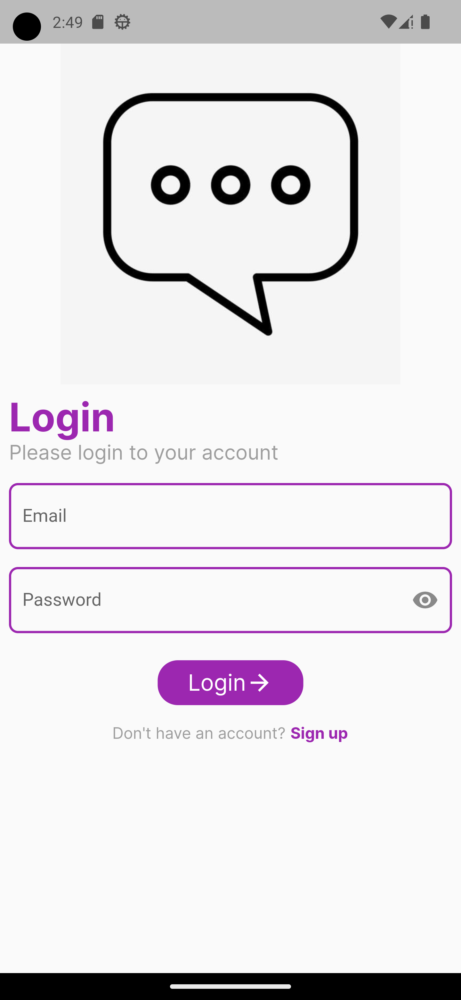
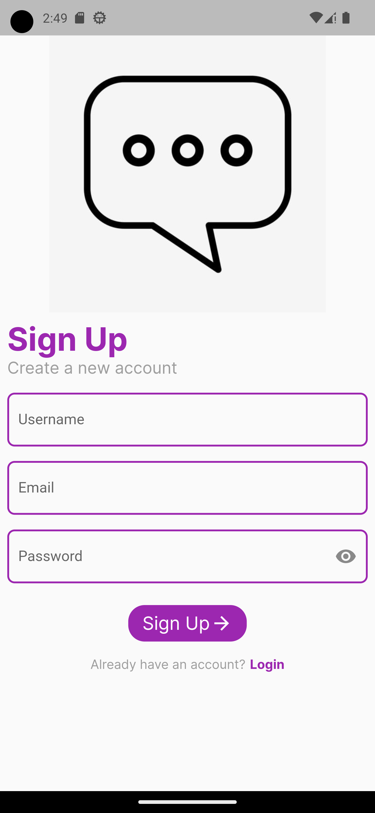
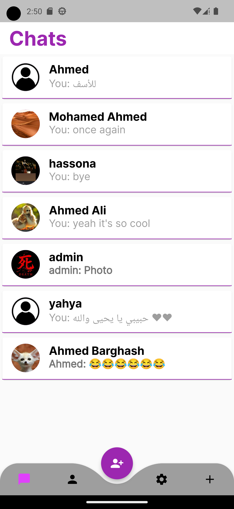
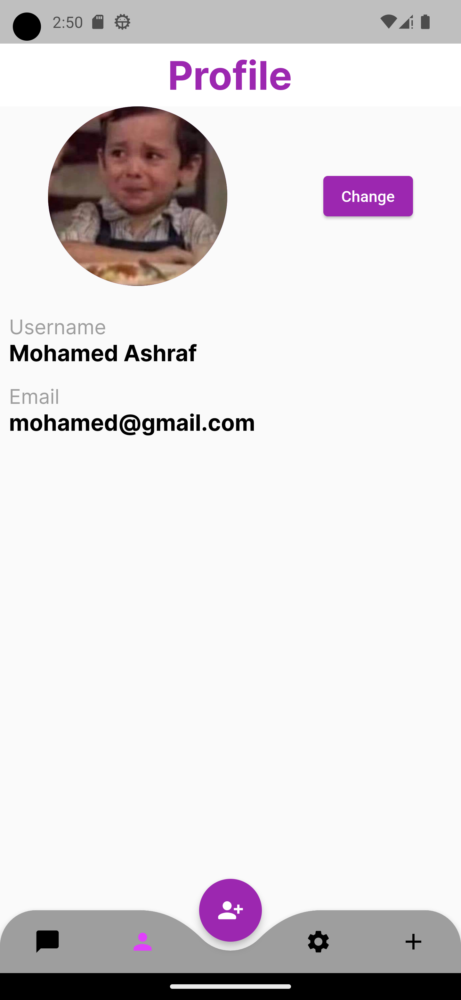
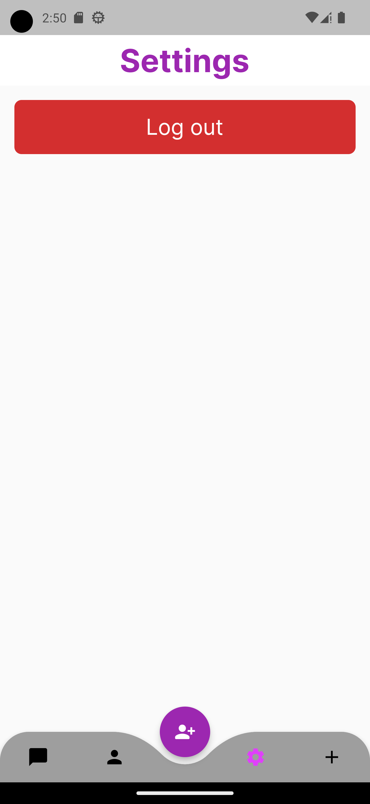
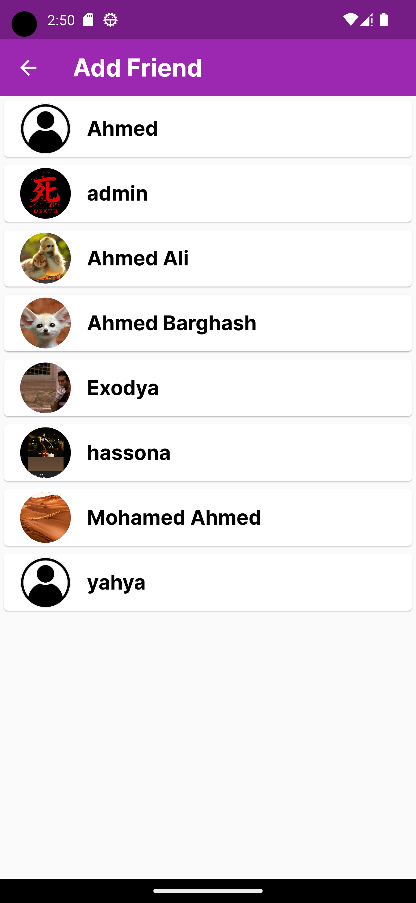
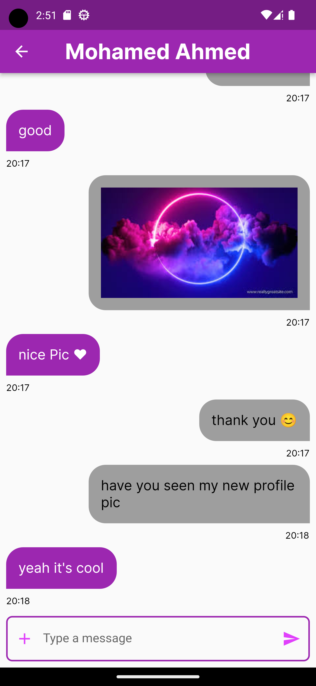

# Send It - Your Ultimate Chat App

<p align="center"></p>

**Send It** is a powerful and feature-rich chat app built with Flutter and Firebase, designed to revolutionize the way you connect and communicate with friends and loved ones. With a focus on real-time messaging and a seamless user experience, "Send It" is your go-to app for staying connected.

## Features

- **One-to-One Chat Rooms**: Engage in dynamic conversations that capture the essence of real-time interaction.

- **Photo Sharing**: Share memorable moments instantly by sending photos through our intuitive interface.

- **Custom Profile Pictures**: Reflect your unique style with profile pictures that resonate with your personality.

- **Latest Message Sorting**: Stay organized with chats arranged by the latest messages, ensuring your most relevant conversations are always at hand.

## Technologies Used

- **Dart and Flutter**: Our app is built using the dynamic Dart language and Flutter framework, ensuring a responsive and visually stunning user interface.

- **GetX for State Management**: We leverage the power of GetX for efficient and effective state management, keeping your app running smoothly and intuitively.

- **Firebase Authentication**: Your security is our top priority. Firebase Authentication provides a seamless, reliable, and secure authentication process.

- **Firebase Storage**: Store and share images effortlessly using Firebase Storage, making memories instantly accessible.

- **Firebase Firestore**: Enjoy real-time chat functionality with Firebase Firestore, ensuring your conversations remain dynamic and engaging.

## LinkedIn Post

Check out our LinkedIn post featuring a video showcasing the project in action! 🎥

🔗 [LinkedIn Post with Video](https://www.linkedin.com/posts/mohamed-ashraf-gaber-67388818b_flutter-dart-chatapp-activity-7100531643949457408-zAH1?utm_source=share&utm_medium=member_desktop)

Feel free to like, share, and comment to let us know your thoughts!

## Screenshots

<div align="center">
  
  
  
  
  
  
  
</div>

## Installation

To get started with "Send It," follow these steps:

1. Clone the repository:

   ```bash
   git clone https://github.com/Mohamed-code-13/Send-It-Flutter.git
   ```

2. Set up Firebase:

- Create a Firebase project at **Firebase Console**.
- Configure Firebase Authentication, Firebase Storage, and Firebase Firestore.

3. Navigate to the project directory:

   ```bash
   cd Send-It-Flutter
   ```

4. Install dependencies:

   ```bash
   flutter pub get
   ```

5. Run the app:

   ```bash
   flutter run
   ```

#### Note

- These files are included in the _.gitignore_ file and you have to generate them with your **apiKeys** from **Firebase**
  - /lib/firebase_options.dart
  - /android/app/google-services.json
  - /ios/Runner/GoogleService-Info.plist
  - /macos/Runner/GoogleService-Info.plist

## Usage

1. Register and log in to your account.
2. Explore the intuitive user interface and enjoy one-to-one chat rooms.
3. Share photos, customize your profile picture, and experience the convenience of latest message sorting.

## License

This project is licensed under the **MIT** License
